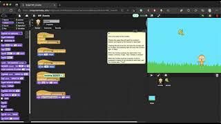

# Introduction

> Hello! I am pursuing a Bachelor of Science in Computer Science and I am looking to gain real-world experience in the technology field through internships! I have an interest in back-end development, software development, mobile application development. I have experience in Java, Kotlin, Python, C, C++, and ARM programming languages, with Java being my current most comfortable language.
>
> Nice to meet you!

# Project Video Links for EDS 124BR
 
- [Link: First Snap Program using Sequences of Instructions](https://youtu.be/0iLhSfZvBAg)

- [Link: Second Snap Program using Repeats](https://youtu.be/YgPezMK1dVo)

- [Link: Third Snap Program - Animal Parade](https://youtu.be/pJPGYLmcbvE)

- [Link: Forth Snap Program - Nested Repeats](https://youtu.be/Am71eo9fWj0)

- [Link: Fifth Snap Program - Events](https://youtu.be/plz8m75Q3UY)

- [Link: Sixth Snap Program - Variables](https://youtu.be/LaI2k8ZaK2Y)

- [Link: Seventh Snap Program - Conditional Loops](https://youtu.be/kaxHyTzuVrY)

- [Link: Eighth Snap Program - If Else](https://youtu.be/Bm_SzjAImr0)

- [Link: Ninth Snap Program - Nested If Else](https://youtu.be/WstmK-HV7qU)

- [Link: Tenth Snap Program - Compound Conditionals](https://youtu.be/08hpSdMmNa8)

# Reports
